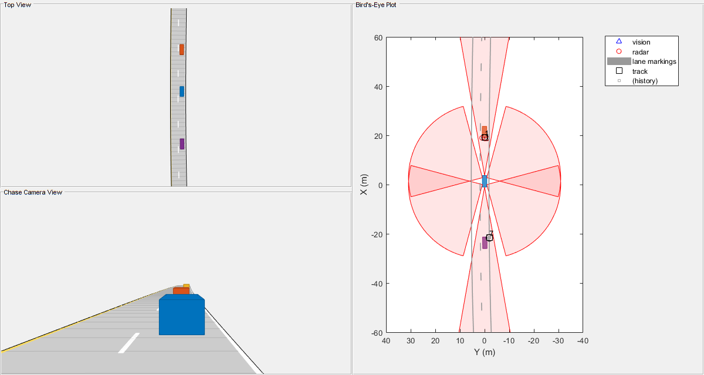

# Radar

Radar project from Udacity course

# CA CFAR 2D
This illustartes best the 2d CA CFAR alorithm. The file can be generated with exercise06b.m


-1 -> cells of the range doppler map which are initally set to zero to allow for propper filtering due to edges  
0  -> untouched cells of the range doppler map  
1  -> cell under test (CUT)  
2  -> guard cells  
3  -> training cells  

## Some code snippets
The training, guard cells and the threshold offset (dBW) are defined initally by
```matlab
%Slide Window through the complete Range Doppler Map select the number of Training Cells in both the dimensions.
T=[8,4]; % 8 trainng cells for range band and 4 for the doppler band
%Select the number of Guard Cells in both dimensions around the Cell under test (CUT) for accurate estimation
G=[4,2]; % see comment training cell
% offset the threshold by SNR value in dBW
offsetThresholdIndB=3;
```

This zeros out the margins:
```matlab
iSpan=[T(1)+G(1), Ni-T(1)-G(1)+1 ];
jSpan=[T(2)+G(2), Nj-T(2)-G(2)+1 ];
for j = 1:Nj
    for i = 1:Ni
        if(~(i>iSpan(1) && i<iSpan(2) && j>jSpan(1) && j<jSpan(2)))
            s(i,j)=0;
            CFARImage(i,j)=-1;
        end
    end
end
```
